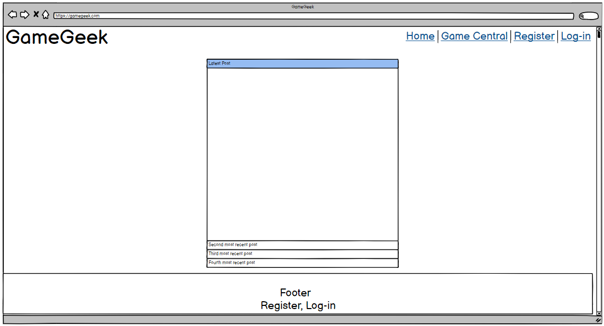
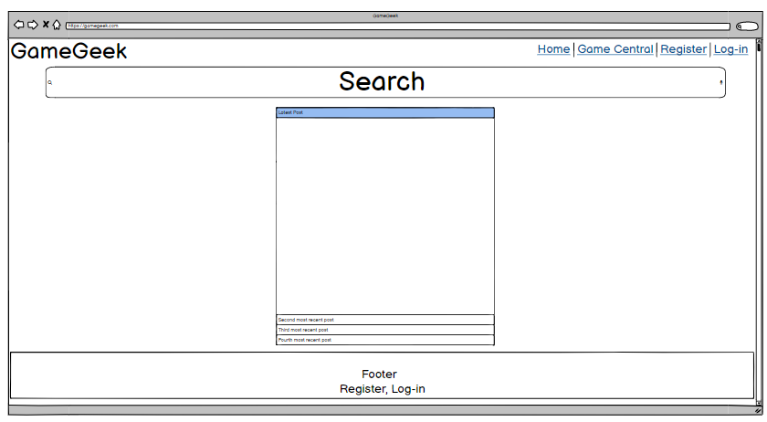
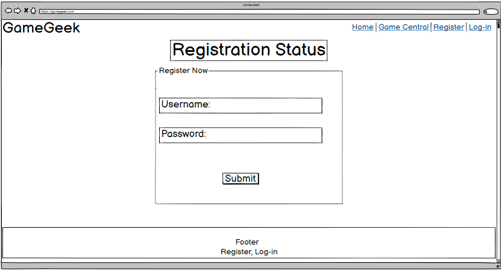
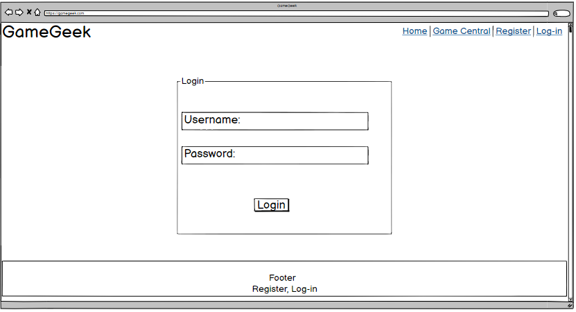
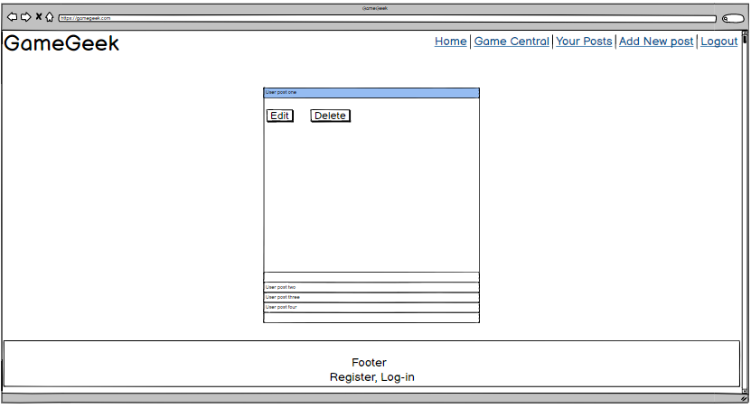
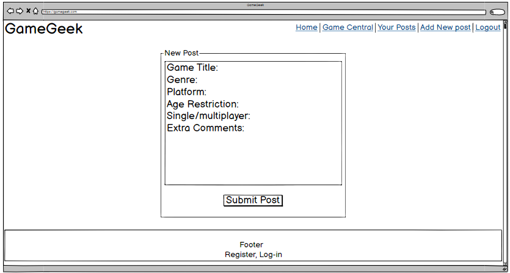
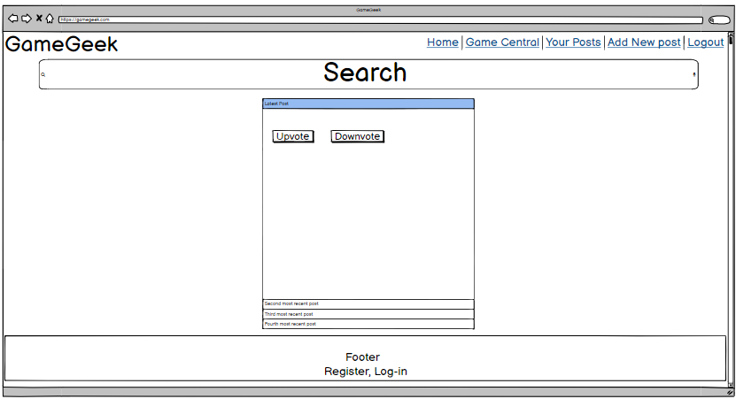
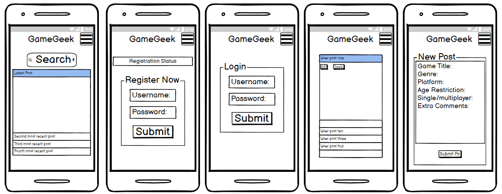

# **_Milestone-Project-3-GameGeek_**  

# **_Introduction:_**

In the Third Milestone project for the code institute. The project objective
is to design a full-stack website using what I have learnt during the python and backend development modules whilst integrating 
previously aquired knowledge of HTML and CSS and Javascript. For this project I will be designing a forum site
where users can register and post reviews or just their humble opinions on games they enjoy to play. These posts will be available to 
view by anyone who visits the site, but only registered users can post reviews. Anyone wil be able to search the site using a game title, or genre
or by whether the game is playable in single or multiplayer modes. Thes reults will show games relating to the keywords which re searched.
The website will feature an admin page where the admin can view and delte user posts if they deem the post to be innapropiate.
Where the project stands by the end will demonstrate my ability to implement frameworks, database structures and the use of python
to create a functioning full-stack website which can later be ellaborated to create a great community forum.

# **_Purpose:_**

The website above was created for the purpose of achieving the third Milestone Project for the Code 
Institute's Full Stack Developer course.The website was developed using the knowledge gained from the python 
and back-end developement modules as well as my pre-aquired knowledge of HTML, CSS and Jquery.

# *User Stories:*

* As a user, I want to be introduced to the site. I'd like to know what it is all about and why I should consider registering.
* As a user, I want to be told what the username and password requirments are, am I required to use letter, symbols, numbers?
* As a registered user, I want to be able to view my own posts without scrolling through all the posts within he site.
* As a registered user, I want to be able to edit and delete my posts if I need to.
* As a registered user, I expect to be able to logout securely after I am done using the site.

# *User Story Testing:*
* The website home page features a brief invitation to new visitors to explore and register to the site. 
* The registration form has clear bold statements specifying the needs of the form in order to pass validation.
* The user can see their posts on their personal profile page.
* On the profile page, in the collapsable header there are fully functioning edit and delete buttons.
* There is a logout function and a flash message will appear confirming the user has been logged out.

# *The Surface Plane:*

### *The font:*

The font is kept simple for this page as it is meant to be an easy page to navigate through and easy to understand. 
By using the font Rubik, It allows the page to become an easy read as there isn’t a specific design to it, it’s very simple. 
It also isn’t as plain as say new times roman which will give the site a more professional look, but the theme of the website 
should be more fun and vibrant as these are the kind of characters that play games. The weights consist of the headers – 600, 
subheadings- 400, body text between 200-400. This is to attract the user’s attention. If the text would be the same weight 
throughout it would become messy and hard to navigate. Weight 700 is also installed in CSS but in this website, it would be 
too bold and would take away from the page itself making it not flow as well as it currently does. 

### *The imagery:*

There isn’t a great deal of imagery on this site and its aim was to stay focused on the purpose of it being a review site and
the increase in images may have taken away from the detail a review may have. However, there is a logo that uses the colour 
scheme and the font to match the aesthetic of the website, the controller was added to give users an instant feel of what the 
website is about without adding over complication.  

### *The colour scheme:*

The Colour scheme consists of a RGB colour palette. Red, Green and Grey have been used as upon conducting research on other
gaming websites the colours always seemed to be bright and they stand out significantly. Having a grey background still allows 
the text to be read with no struggle, but it also makes the bright colours stand out more without the contrast that the bright 
on white or black would have. Making it easier to focus on the page.  

# *Skeleton:*

 

# *Differences to design:*

The idea's posed during the planning phase of my project differ in a small way from my final design. 

Firstly, My initial plan when creating the wireframes for this project did not include a home page with a big website logo
and an introductory paragraph, opposing to this the initial idea of the home page was to have a few of the most recent 
posts from 'Game Central' displaying on the home. After careful consideration however, I figured a user would like to 
actually like to know what the aim of the site is about which is directly reflected in my user stories.

Secondly, My initial idea was to display user posts on a seperate page named my posts however after reviewing this in practise,
the website was soon becoming cluttered with more and pages and I was able to integrate user posts onto their personal page.

Lastly, as can be seen in the wireframes, I planned to add an up-vote and down-vote option for user posts in the game central,
this would be a great addition and hopefully one which I may be able to implement in the future. Unfortunatly, 
at this moment in time it was beyond the scope of my learning and I'd run the risk of missing out key features if 
I spent too much time focusing on adding this feature.

# *Structure:*

For a website to be able to meet their user needs the website needs to be simple in terms of navigation, thus making it
easy to use and most importantly it needs to provide the relevant feautures. This website provides all of these things. 
It’s simple in the way that there isn’t too mush going on, with aspects such as design and depth of narrative. 
The links that are allocated to each page are easy to follow and very user friendly. Being situated at the top of the page 
and being hidden away inside a side nav on small and medium devices allows for a clean look and feel when browsing.
Each navigation link is fully working and pages display as they should, the edit button in the user profile page will open an 
edit page and form submissions work as intended. The site remains just as usable on a small device as it is on a large device,
thanks to mobile first design which makes the site easily accessible whenever user wishes to.

# *Scope:*

The planned features for the website are:

* A website logo- A logo to give the website a more professional feel, it was made by myself in adobe photoshop and more 
is written about it in the imagery section of this readme.

* Page Headings- Due to the vast feautures of the site each page has a heading on the top, the heading follow the same styling
throughout and ensure that the user isn't losing track of what page their on for example if they were to get distracted.

* A search bar- Anticipating many user posts in the future, it will make it easy for users to find wha they're searching for.
For example a user maybe interested in playing the latest Call of Duty but would lkke honest reviews from fellow gamers before 
commiting to the purchase. The user can simply search for Call of duty and all reviews related to that game name will be 
displayed.

* Registration- In order for a user to be able to post any reviews themselves they must register n the site first.

* Login- A returning user can log back in and review all their previous posts, edit or delete them. 

* Admin- This profile can be used to delete any reviews, this is useful for when a some user chooses to become 
offensive or include any innapropiate text in their review.

* Flash messages- Functions such as registering, adding reviews, logging in and out of the site as well as editing
or removing reviews are all supported by flash messages which confirm the request have been actioned.

* Blocking/removing users- If users were o be notoriously innapropiate they could be banned and removed from the site.

# *Website Features:*
### *Existing:*
* A website logo

* Page Headings

* A search bar

* Registration

* Login

* Admin Area.

* Flash messages

_Note_: The current implemented features differ from the initial proposal. The reasons for this are that removing users
would caause a dillema on how to treat their posts whether they would be deleted to or be left with an empty 'created by:'.
removing which is linked to a particular user would unfortunatly require much more time spent which due to the course deadline
would not be feasable.

### *Future:*

In the future a feature I'd definatly like to return to try and implement is removing users. As well as this I'd like to add
the ability to like/'up-vote' or dislike/'down-vote' and comment on others reviews. These functions collectivel would improve 
website for user-experience as well as improve the way it cn be managed by the sites admin.

# *Technologies:* 

## *Languages used:*

* HTML
* CSS
* python

## *Frameworks, Libraries and programs Used:*

* Materialize
    * Used to assist in the reponsivness and functionality of the site.
* Jquery
    * Used to help implement Materialize features with in the app.
* Flask
    * The Flask framework was used to develop the web app.
* MongoDB
    * Mongo databse was used to store the app data.
* Werkzeug
    * A tool used to help with debugging.
* Photoshop
    * Used to create the logo.
* Google Chrome Developer Tools
    * Google chrome built in developer tools were used to inspect page elements and help debug issues.
* Google Fonts
    * Google fonts are used throughout the project to import the Playfair Display and serif fonts.
* Font Awesome
    * Font awesome Icons were used for the Social media links contained in the Footer section of the website.
* Techsini
    * Multi Device Website Mockup Generator was used to create the Mock up image in the readme.md file.
* GitHub
    * GithHub is the hosting site used to store the source code for the Website.
* Git
    * Git is the version control software used to commit and push code to the GitHub repository 
    where the source code is stored.
* Balsamiq Wireframes
    * Used to create wireframes for User experience design.
* Favicon
    * Favicon.io was used to make the website favicon.

# *Testing:*

Throughout the project the debugger has been active thus allowing me to spot and fix critical issues as and when these occured. 
Additionally to these however there has of course been user sotry testing which took place and was mentioned in the user story 
section of this ReadMe file.

Further to this some final testing was carried out such as making sure both the main nav bar as well as the side nav for small and 
medium devices work properly. A major factor in having a well working nav bar was creating a base html which other html files
extend from; this one saves time as oppose to having to re code a navbar on each individual page as well as minimise the margin 
for error. The tested site has proven to be responsive with no broken links, each form works correctly and updates 
the database accordingly. Responsive buttons for editing and deleting user posts also work as expected.

The web app was also tested in google chrome, using chrome developer tools I tested the websites responsivness on small, medium
and large devices. Each page was assessed on all devices making sure that it displays correctly and no issues arise fro musing the 
app on a different device.

# *Deployment:*

## *Project Creation:*
I began by creating a new github repository, using as always the code institute template. I named this new repository 
'Milestone-Project-3-GameGeek' and slected 'include all branches'. I then went onto gipod and left that where it was for a period
of time whilst I set up my Mongo Db, I created a new cluster called GameGeek which directly related to my app name, 
inside this cluster I created a database called game_central within which I created 5 collections. The collections were as 
follows: ages, games,genres, players and users. The games collection is where the main review is held, the reason why it is 
called games as oppose to reviews is because the whole review is relating to the game title which the user inputs as the 
first line of the form when they are submitting a new review. This also makes sense whe users go to search for games as 
no one would be searching for a review, the user would want to find a review about a game based on the game name.
The next step was to set up the flask app, back in gipod in the command terminal I used pip3 install flask, 
this imports the flask functionality. I then created a file named app.py which is the python file where the app will be coded.
Next was creating the env.py file and hiding this in gitignore I set up the env.py file which connected me to the Mongo Database.
Once env.py was created and flask was imported, I ceated an instance of flask inside the app.py file.
I then created the requirements.txt file and procfile and made m way to Heroku to create a new app. I then connected the heroku to 
my Github repo via automatic deployment which means taht any further commits will actively be updated to Heroku. 
From here I began to further set up and create my app. Once the project was more or less finished, I deployed the app in 
Heroku by selecting the master branch and deploy branch. From here my app was deployed.
This is slighlty different and a new way for me to deploy my site as previously I deployed via github, sites can also be 
deployed via a local machine. For the educational purpose of this document, below is how I would deploy a site using either Github 
or a local machine:

### *Deploying Using Github Pages:*

    * Navigate to the GitHub Repository:
    * Click on the 'Settings' Tab.
    * Scroll Down to 'Git Hub Pages' Heading.
    * Select 'Master Branch' as the source.
    * Click the Save button.
    * Click on the link to go to the live deployed page.

### *Deploying by running off a local machine:*
    * Begin by Navigating to the GitHub Repository.
    * Then click the Code drop down menu.
    * You can either choose to Download the ZIP file, unpackage locally and open with IDE (This route ends here) 
    alternatively copy the Git URL from the HTTPS dialogue box.
    * Open your developement editor of choice and open a terminal window in a directory of your choice.
    * Use the 'git clone' command in terminal followed by the copied git URL.
    * Finally a project clone will be created locally on your machine.